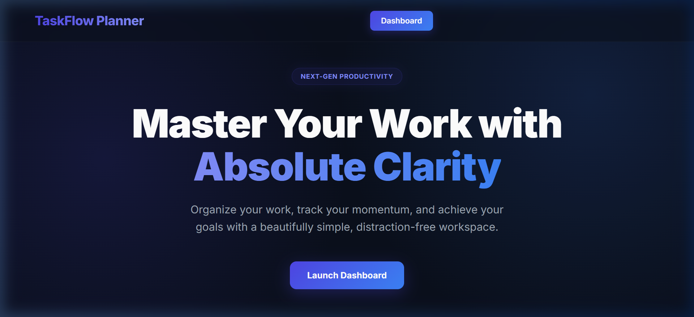
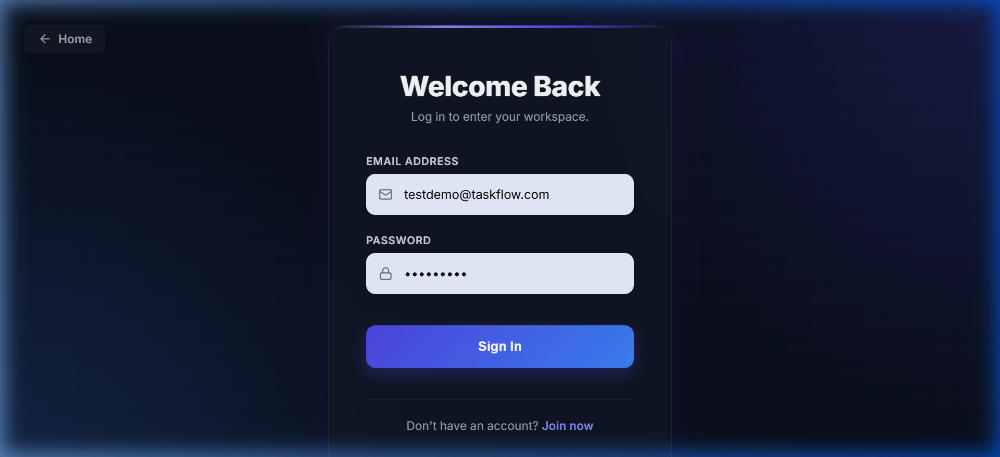
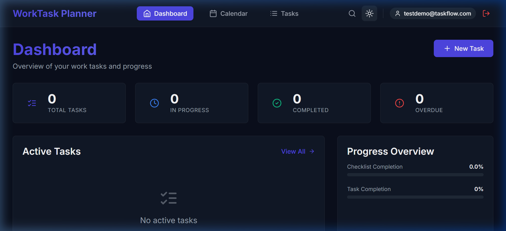
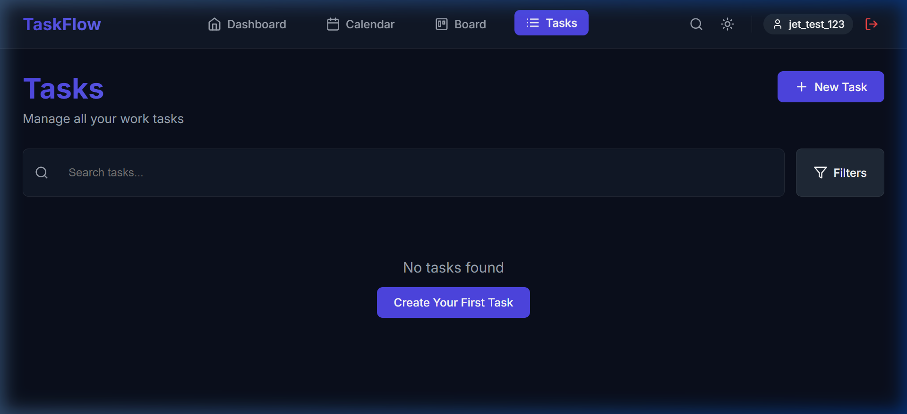
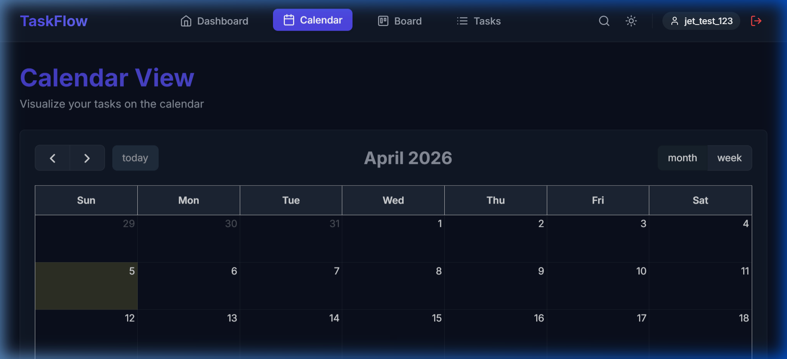

<p align="center">
  
</p>

<h1 align="center">⚡ TaskFlow</h1>

<p align="center">
  <strong>A modern, full-stack task management platform built for developers who think in sprints.</strong>
</p>

<p align="center">
  <a href="#-features">Features</a> •
  <a href="#-screenshots">Screenshots</a> •
  <a href="#%EF%B8%8F-tech-stack">Tech Stack</a> •
  <a href="#-getting-started">Getting Started</a> •
  <a href="#-api-reference">API Reference</a> •
  <a href="#-project-structure">Project Structure</a>
</p>

<p align="center">
  
  
  
  
  
</p>

---

## 🎯 What is TaskFlow?

**TaskFlow** is a production-ready task management application designed for individual developers and professionals who want to organize their work with clarity. Unlike generic to-do apps, TaskFlow is purpose-built around developer workflows — with features like **Jira ticket linking**, **Git branch tracking**, **multi-stage checklists**, and **task dependency mapping**.

> **🔗 Live Demo:** [trytaskflow.vercel.app](https://trytaskflow.vercel.app)

---

## ✨ Features

### 🔐 Authentication & Security
- JWT-based authentication with secure token management
- Password hashing with Bcrypt
- Protected routes with automatic session restoration
- Per-user data isolation — your tasks are 100% private

### 📋 Task Management
- Full **CRUD operations** — create, read, update, delete tasks
- **4-level priority system** — Low, Medium, High, Urgent (color-coded)
- **4 status stages** — Todo, In Progress, Done, Blocked
- Rich text descriptions and personal notes per task
- Due date and assigned date tracking with overdue highlighting

### ✅ Deep Checklists
- Break tasks into multi-stage sub-tasks (development → testing → merge → deployment)
- Link **Git branches** directly to checklist items
- Visual progress tracking per task
- Drag-and-drop reordering

### 🔗 Task Dependencies
- Link related tasks together
- Visualize which tasks block others
- Dependency status tracking (see if blocking tasks are completed)

### 📊 Dashboard Analytics
- At-a-glance stats: total, in-progress, completed, overdue tasks
- Checklist completion rate with progress bars
- Task completion percentage
- Quick access to active tasks

### 📅 Calendar View
- Interactive monthly/weekly calendar powered by FullCalendar.js
- Tasks plotted by assigned date
- Click any date to see or create tasks
- Today highlighting

### 🔍 Search & Filters
- Real-time search across task titles, descriptions, and Jira IDs
- Filter by status, priority, and date range
- Combined filters for precise task discovery

### 🎨 UI/UX
- Glassmorphic dark theme with premium "Void Blue" aesthetic
- Light/dark mode toggle with smooth transitions
- Fully responsive — works on desktop, tablet, and mobile
- Smooth animations and micro-interactions

### 🔌 Jira Integration
- Import tasks from Jira tickets (extensible architecture)
- Store Jira ID and URL per task for cross-referencing

---

## 📸 Screenshots

<details>
<summary><strong>🏠 Landing Page</strong> — Click to expand</summary>
<br />

</details>

<details>
<summary><strong>🔑 Login Page</strong> — Click to expand</summary>
<br />

</details>

<details>
<summary><strong>📊 Dashboard</strong> — Click to expand</summary>
<br />

</details>

<details>
<summary><strong>📋 Tasks View</strong> — Click to expand</summary>
<br />

</details>

<details>
<summary><strong>📅 Calendar View</strong> — Click to expand</summary>
<br />

</details>

---

## 🛠️ Tech Stack

### Frontend
| Technology | Purpose |
|-----------|---------|
| **React 18** | Component-based UI with hooks |
| **React Router v6** | Client-side routing with protected routes |
| **Vite** | Lightning-fast dev server and build tool |
| **FullCalendar.js** | Interactive calendar component |
| **Axios** | HTTP client with interceptors for auth |
| **Lucide React** | Modern icon library |
| **Vanilla CSS** | Custom design system — no framework dependency |

### Backend
| Technology | Purpose |
|-----------|---------|
| **Python 3.8+** | Server-side runtime |
| **Flask 3.0** | Lightweight REST API framework |
| **Flask-SQLAlchemy** | ORM for database operations |
| **Flask-JWT-Extended** | JWT authentication & authorization |
| **Flask-Bcrypt** | Password hashing |
| **PostgreSQL** | Production database (SQLite for local dev) |

### DevOps
| Technology | Purpose |
|-----------|---------|
| **Vercel** | Frontend & backend deployment |
| **PostgreSQL (Cloud)** | Managed production database |
| **Git** | Version control |

---

## 🚀 Getting Started

### Prerequisites

- **Python** 3.8+
- **Node.js** 16+
- **npm** or **yarn**

### 1. Clone the repository

```bash
git clone https://github.com/NagarajuReddyBoggala/WorkTask-Planner.git
cd WorkTask-Planner
```

### 2. Backend Setup

```bash
cd backend

# Create virtual environment
python -m venv venv

# Activate it
# Windows:
venv\Scripts\activate
# macOS/Linux:
source venv/bin/activate

# Install dependencies
pip install -r requirements.txt

# Run the server
python app.py
```

The API will be available at `http://localhost:5000`

### 3. Frontend Setup

```bash
cd frontend

# Install dependencies
npm install

# Start dev server
npm run dev
```

The app will be available at `http://localhost:3000`

### 4. Environment Variables (Production)

| Variable | Description |
|----------|-------------|
| `DATABASE_URL` | PostgreSQL connection string |
| `JWT_SECRET_KEY` | Secret key for JWT token signing |

---

## 📡 API Reference

All endpoints (except auth) require a valid JWT token in the `Authorization: Bearer <token>` header.

### Authentication
| Method | Endpoint | Description |
|--------|----------|-------------|
| `POST` | `/api/auth/register` | Register a new user |
| `POST` | `/api/auth/login` | Login and receive JWT token |
| `GET` | `/api/auth/me` | Get current user profile |

### Tasks
| Method | Endpoint | Description |
|--------|----------|-------------|
| `GET` | `/api/tasks` | List all tasks (with filters) |
| `GET` | `/api/tasks/:id` | Get task details with checklist & dependencies |
| `POST` | `/api/tasks` | Create a new task |
| `PUT` | `/api/tasks/:id` | Update a task |
| `DELETE` | `/api/tasks/:id` | Delete a task |

### Checklists
| Method | Endpoint | Description |
|--------|----------|-------------|
| `POST` | `/api/tasks/:id/checklist` | Add checklist item to a task |
| `PUT` | `/api/checklist/:id` | Update a checklist item |
| `DELETE` | `/api/checklist/:id` | Delete a checklist item |

### Dependencies
| Method | Endpoint | Description |
|--------|----------|-------------|
| `POST` | `/api/tasks/:id/dependencies` | Add a task dependency |
| `DELETE` | `/api/dependencies/:id` | Remove a dependency |

### Dashboard & Jira
| Method | Endpoint | Description |
|--------|----------|-------------|
| `GET` | `/api/dashboard/stats` | Get dashboard statistics |
| `POST` | `/api/jira/import` | Import a task from Jira |

---

## 📁 Project Structure

```
TaskFlow/
├── backend/
│   ├── app.py                 # Flask app, models, and all API routes
│   ├── requirements.txt       # Python dependencies
│   └── vercel.json            # Vercel serverless config
│
├── frontend/
│   ├── src/
│   │   ├── components/        # Reusable UI components
│   │   │   ├── Layout.jsx     # App shell with navbar
│   │   │   ├── TaskCard.jsx   # Task card component
│   │   │   └── TaskModal.jsx  # Create/edit task modal
│   │   ├── pages/             # Route-level pages
│   │   │   ├── Dashboard.jsx  # Dashboard with stats & charts
│   │   │   ├── TaskList.jsx   # Task list with search & filters
│   │   │   ├── TaskDetail.jsx # Task detail with checklist & deps
│   │   │   ├── CalendarView.jsx # FullCalendar integration
│   │   │   ├── LandingPage.jsx  # Public landing page
│   │   │   ├── LoginPage.jsx    # Authentication - login
│   │   │   └── RegisterPage.jsx # Authentication - register
│   │   ├── contexts/          # React context providers
│   │   │   ├── AuthContext.jsx  # Auth state management
│   │   │   └── ThemeContext.jsx # Theme toggle state
│   │   ├── services/          # API service layer
│   │   │   └── api.js         # Axios instance & API methods
│   │   ├── App.jsx            # Root component with routing
│   │   └── main.jsx           # Entry point
│   ├── package.json
│   └── vite.config.js
│
├── docs/
│   └── screenshots/           # App screenshots for README
│
└── README.md
```

---

## 🏗️ Architecture Highlights

- **Separation of Concerns** — Clean split between API layer (`services/api.js`), state management (`contexts/`), UI components, and pages
- **Protected Routes** — HOC pattern wrapping authenticated routes with automatic redirect
- **JWT Token Flow** — Token stored in localStorage, auto-attached to every API request via Axios interceptors
- **Database Flexibility** — SQLite for local development, PostgreSQL for production, swapped via environment variable
- **RESTful API Design** — Resource-based routing with proper HTTP methods and status codes
- **Cascading Deletes** — Deleting a task automatically removes its checklist items and dependencies

---

## 🗺️ Roadmap

- [ ] Drag & Drop Kanban Board
- [ ] Task Analytics with Charts (Recharts)
- [ ] Database Migrations with Alembic
- [ ] Export to CSV/JSON
- [ ] Profile Page & User Settings
- [ ] Toast Notification System
- [ ] Unit & Integration Tests
- [ ] CI/CD Pipeline with GitHub Actions

---

## 👤 Author

**Nagaraju Reddy Boggala**

- GitHub: [@NagarajuReddyBoggala](https://github.com/NagarajuReddyBoggala)

---

## 📄 License

This project is open source and available under the [MIT License](LICENSE).

---

<p align="center">
  <strong>⭐ If you found this useful, consider giving it a star!</strong>
</p>
